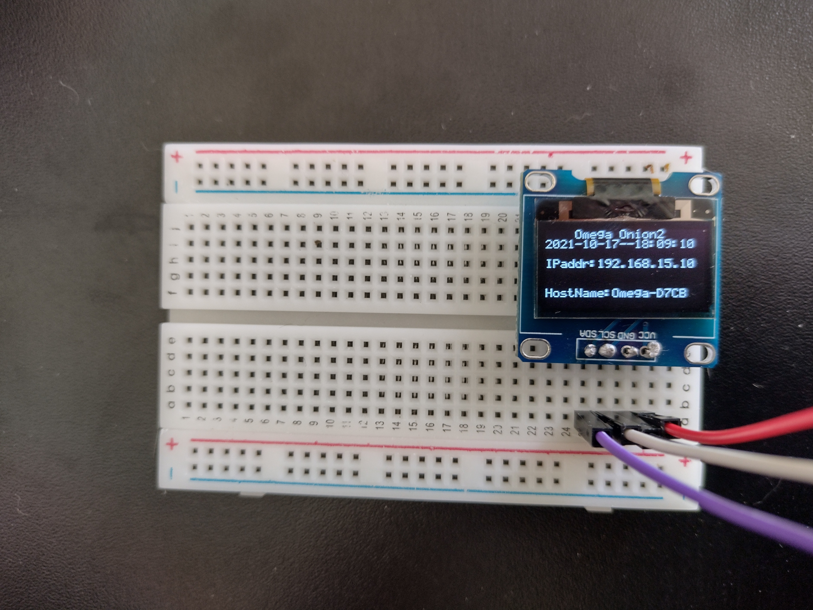

======================
Brincando com o Omega2
======================

Campinas, 17 de outubro de 2021

Há uns 5 anos atrás, em julho de 2016, eu estava contribuindo financeiramente
com um projeto no Kickstarter pro desenvolvimento de um 'computador de IoT'
chamado Omega2.
Hoje, finalmente, eu fiz meu primeiro "projeto" de aprendizado usando essa
plaquinha. Na verdade eu comecei ontem, quando chegaram, pelo correio, os
componentes que eu comprei em um loja online. Inclusive, achei tudo muito bem
embalado e a única coisa que veio com defeito foi um LED difuso vermelho, que
custou R$0,20, ou seja, não faz sentido pedir outro no lugar.

É muito louco pensar que em setembro de 2016, quando de fato a fatura chegou
com o valor do Omega2 convertido em reais, estávamos com o dólar na casa dos
R$3,34 (sim, eu fui buscar a fatura e fazer a conta de padeiro). Ele custou
US$20 na época - o computador custava US$5 e o dock de expansão custava
outros US$15. Hoje o dólar está bem mais perto do dobro daquele valor e o
Beaglebone Black que eu comprei recentemente custou umas treze vezes mais em
reais. Tudo bem que o Beaglebone custa uns US$56, mas ainda assim, treze
vezes...

De qualquer forma, isso é só um registro histórico e ainda quero deixar
registrado que estou feliz de estar podendo brincar com a placa mesmo que
tenha demorado tanto ou talvez exatamente porque demorou tanto. Acho que cada
vez mais entendo o significado que frases batidas que sempre habitaram a minha
mente como "o significado de sucesso é diferente para cada pessoa" e "cada um
tem seu tempo". É possível que eu esteja aprendendo a reconhecer meu tempo e,
com isso, aprendendo a respeitá-lo.

E agora, algumas fotos e o link pra fonte original do projeto.

{ width=25% } { width=25% } { width=25% }

Referência: [Omega Onion2 OLED Screen Show IP and LAN Name](https://www.instructables.com/Omega-Onion2-OLED-Screen-Show-IP-and-LAN-Name/)

P.S.: Tenho que admitir que entre ontem e hoje apanhei pra fazer algumas
coisas funcionarem. Por exemplo, tive que soldar os pinos no OLED porque nada
fazia com que ele respondesse direito; eu nunca tinha soldado nada (tirando a
tentativa de soldar a porta que desconsidero porque falhou miseravelmente).
Além disso, só agora (quase no fim do dia) descobri que eu tinha invertido os
pinos do LED difuso vermelho. Ou seja, 100% de aproveitamento nas compras
online, ótima loja, recomendo!
